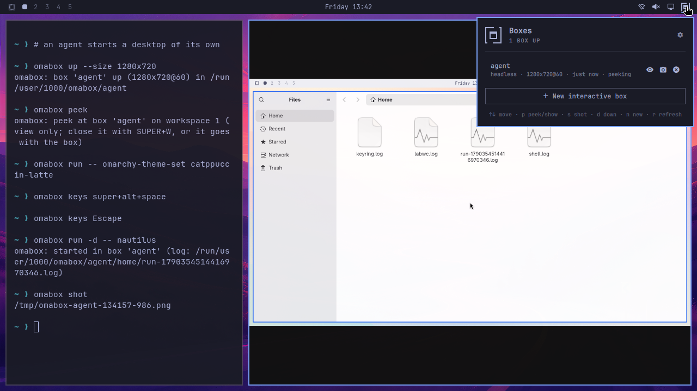
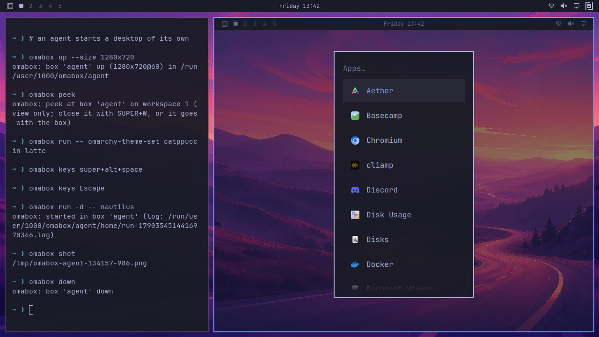
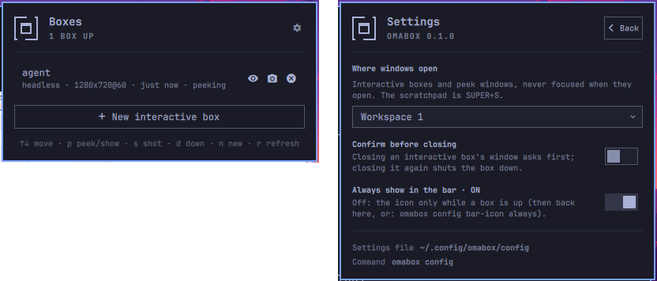

<h1>
  <picture>
    <source media="(prefers-color-scheme: dark)" srcset="assets/omabox-lockup-dark.svg">
    
  </picture>
</h1>

**A desktop of their own, for your agents.** omabox gives an AI agent a whole Omarchy desktop to
launch, drive and screenshot apps and shell plugins in, invisible and apart from yours: no windows
on your screen, no stolen focus, no cursor jumps or workspace switches, no tray icons, notifications
or keyring entries left in your session.

A box is the real thing, not a mock: Omarchy's own Hyprland config (its binds, look and window
rules), the Omarchy shell (bar, menu, tray, notifications) and your current theme, bar layout,
terminal settings and toggles, on a private screen and a private D-Bus session bus. Your own
`~/.config/hypr` is not loaded. It starts in 3-4 s and uses about 500 MB. When you want to look,
peek at a box live, or open one as a window and use it yourself.

[](https://diogochaves.github.io/omabox/docs/media/demo.mp4)

[Watch the 55 second demo](https://diogochaves.github.io/omabox/docs/media/demo.mp4)

### Recorded in a box, in a box

The demo was recorded inside omabox, with no screen recorder on a real desktop. `docs/demo.sh`
starts one box to play the desktop (Omarchy's stock bar and theme, the omabox widget in its bar, a
terminal) and drives omabox from that terminal the way an agent would. Every `omabox up` there
starts a box inside the box:

- `omabox up` in the terminal starts the agent's box within the stage box, and `omabox peek` shows it
  live next to the terminal. The theme switch, Omarchy's menu, Files and the screenshot all happen
  in the agent's box; the stage keeps its own theme.
- **New interactive box** in the stage's widget starts a third desktop, as a window on the stage's
  screen, with Omarchy's menu open inside it.
- wf-recorder runs inside the stage and records its screen, so nothing of the real desktop is in
  the frames, and the real desktop saw no window, focus change or workspace switch.

It is the same trick the test suite uses to check interactive mode, peek and the agent guard
without touching your desktop: a box can stand in for it. `docs/demo.sh --video` makes the video
and the pictures here again (it needs wf-recorder).

## What you need

- **Omarchy 4** on Arch, with Hyprland 0.56+ (the Lua config). Built and tested with Hyprland 0.56.2
  on AMD and Intel iGPUs, and on an NVIDIA RTX 4070 SUPER with driver 615.71.09.
- **A GPU render node** (`/dev/dri/renderD*`): a box renders on the GPU. The first usable one is
  picked; `OMABOX_RENDER_NODE` overrides.
- A patched aquamarine (Hyprland's backend library), until a release ships
  [PR #415](https://github.com/hyprwm/aquamarine/pull/415). `install.sh` builds it privately into
  `build/prefix`; your system's copy is not touched.

## Install

```bash
git clone https://github.com/diogochaves/omabox && cd omabox
./install.sh           # packages (sudo only if some are missing), patched aquamarine, tools, links
./install.sh --check   # the same, then start a box, screenshot it, tear it down
```

It links `~/.local/bin/omabox`, the agent skill `omabox` wherever Omarchy puts its own skills
(`~/.agents`, `~/.claude`, `~/.codex`, `~/.pi/agent`, `~/.hermes`, each under `skills/`) and the bar
widget into `~/.config/omarchy/plugins`. It asks whether to turn on the agent guard (below). Turn
the widget on with:

```bash
omarchy plugin enable chaves.omabox
```

**Update**: `git pull && ./install.sh`. It is idempotent; run it after a Hyprland upgrade too: it
checks that the private aquamarine build still matches what Hyprland links against.

## Remove

```bash
omabox down --all                          # every box
omabox guard off                           # if you turned the guard on
omarchy plugin disable chaves.omabox       # if you turned the widget on
rm ~/.local/bin/omabox ~/.config/omarchy/plugins/chaves.omabox
rm -f ~/.agents/skills/omabox ~/.claude/skills/omabox ~/.codex/skills/omabox \
  ~/.pi/agent/skills/omabox ~/.hermes/skills/omabox
rm -rf ~/.config/omabox ~/.cache/omabox    # settings, and box HOMEs a crash left behind
```

Then delete the clone (its `build/` holds the aquamarine build). `omabox guard off` leaves a
`.bak-<time>` of `~/.claude/settings.json` and `~/.codex/config.toml` next to each, from every change
it made. The packages `install.sh` added stay; it printed them as `missing:` if there were any
(`labwc`, `passt` and the build tools are the likely ones): `sudo pacman -Rns` those you do not use.

## Using it

```bash
omabox up                              # headless box, 1920x1080; returns when the bar is drawn
omabox run -d -- ./build/src/myapp     # launch an app inside (detached; prints its log path)
omabox shot                            # screenshot; prints the PNG path (--active: focused window)
omabox keys super+space                # key combos reach Hyprland binds and the focused app
omabox keys -t 'hello world' Return    # type text, then press a key
omabox click 960 540 [right] [--double]
omabox hyprctl -j clients              # the box's Hyprland, never yours
omabox run -- busctl --user list       # any command inside the box; exit code passes through
omabox down                            # kill everything in the box
omabox ls                              # boxes, mode, size, state, plugins
```

Boxes are named after the current git repo, so agents in different repos never share one (unless
two repos have the same directory name: pass `-b` then). Use
`-b NAME` or `OMABOX=NAME` to run several, and `--size 3440x1440` for another screen size
(`3440x1440@144` for a refresh rate, `host` for your focused monitor; `omabox mode` changes it live).
A headless box goes down by itself after 2 hours with no `omabox` command against it, no peek window
and no `omabox run` in progress (`--idle 30m`, `--idle 0` for never, or `OMABOX_IDLE`).
`--stock-bar` gives the box Omarchy's default bar instead of a copy of yours. `--systemd` gives it a
real systemd user manager (`systemctl --user`, `systemd-run --user` timers) for plugins that manage a
service or schedule alarms.
`--env KEY=VAL` sets a variable for the whole box session (a plugin's API base pointed at a stub).
`omabox gpu 10` measures the GPU time of one box's processes when the driver reports per-process DRM
engine counters. NVIDIA 615.71.09 does not report them, so `gpu` shows no per-process figures there.
Use `--size host` to see what an animation costs on drivers that provide counters, since tools that
sum GPU time by process name add a box's Hyprland to yours.
`omabox help` lists every flag.

### Tests that touch the desktop

```bash
omabox run -- ctest --test-dir build --output-on-failure
```

With no box up, `run` starts a throwaway box, mounts the current repo as a **discarded overlay**
(the tests can write `build/Testing/`, your checkout never changes), runs the command and tears the
box down. Notification tests register with the box's bar instead of piling up in yours. Tray tests
need a tray in the box's bar; use `omabox run --stock-bar -- ctest ...` if your own bar omits it.
`up`'s options apply to that throwaway box: `omabox run --net isolated --allow 8081 -- ctest ...`
keeps tests that talk to 127.0.0.1 away from your real services.
With `-b NAME` (or `OMABOX=NAME`) the box must be up: `run` fails rather than start a throwaway.
With a box already up, `run` uses it, and there the repo is read-only: for tests that write into the
tree, `omabox down` first.
The command gets the box's environment, not your shell's. `--pass NAME` (repeatable) hands it one of
your variables, a password too: the value goes through a pipe, never on a command line.

### Shell plugins

```bash
omabox up --plugin ~/code/myplugin          # or an id from ~/.config/omarchy/plugins
omabox restart-shell                          # after editing the plugin
```

The plugin is mounted read-only and turned on in the box's `shell.json` where its manifest says.
The box's bar has the built-in widgets plus the plugins you mount, nothing else.

### Seeing a box yourself

<p></p>

- `omabox peek -b NAME`: a live, view-only window of a headless box (an agent's included) on your
  workspace 9 (or the one you set, below), opened without focus. It only copies frames out, so it never disturbs the agent;
  it closes with SUPER+W or when the box goes down. `omabox shot -b NAME` for a single frame.
- `omabox up --interactive`: the box is a real window on workspace 9 (or the one you set), and you use it directly with
  your GPU, keyboard and mouse. **SUPER+ALT+ESCAPE** toggles sending SUPER keys to the box instead of
  your desktop. Passthrough turns itself off when focus leaves the box, or on the first key you press
  with the pointer outside it. The box follows the window's size. Closing the window ends the box.
- **Settings** (`omabox config`, kept in `~/.config/omabox/config`; the bar widget's panel shows
  and changes the same ones):
  - `omabox config workspace WS`: where interactive and peek windows open, always without focus: a
    workspace `1`-`99`, `special` (Omarchy's scratchpad: SUPER+S shows and hides it) or
    `special:NAME` (bind a key to it yourself). Per box: `up --interactive --workspace WS`,
    `peek --workspace WS`. The default is 9.
  - `omabox config confirm-close on`: closing an interactive box's window asks first. The box opens
    a new window where you are, with Omarchy's menu ("Shut down" / "Keep it running"); closing that
    window too is a yes. It applies to running boxes as well. Per box: `--confirm-close` or
    `--no-confirm-close` on `up`.
  - `bar-icon`: `always` (the default) keeps the widget's icon in the bar with no box up, dimmed, so
    its settings are a click away; `omabox config bar-icon auto` shows it only while boxes exist.
  - `omabox config` lists them; `omabox config KEY default` puts one back.
<p></p>

- **Bar widget** (`plugin/`, id `chaves.omabox`): the omabox mark in the Omarchy bar (dimmed with no box up; `bar-icon auto` shows it only while boxes exist),
  with a count when there are several. Its panel lists each box (mode, size, age, plugins, whether
  it is being peeked at) and offers **Peek** (opens the peek window, or focuses it; for an
  interactive box, **Show** focuses its window), **Screenshot** (opens the PNG) and **Down** (press
  twice within 3 s; Enter on a dead box arms it). **New interactive box** (or `n`) starts one under
  a free name (`omabox up --interactive --new`: box-1, box-2, ...) and brings its window forward.
  Keys: arrows or j/k, Enter or `p` peek/show, `s` shot, `d` down, `n` new, `r` refresh. If `omabox ls` fails, the panel says so (and a notification, once the
  list is dropped after three failures). `install.sh` links it
  into `~/.config/omarchy/plugins/`; turn it on with `omarchy plugin enable chaves.omabox`.
  The gear at the top right opens **Settings** (omawin's layout; Back or Esc returns): `workspace`,
  `confirm-close` and `bar-icon`, changed through `omabox config`.
  It only displays `omabox ls --json` and runs `omabox`; the CLI owns every rule.

## Agents

`install.sh` installs the `omabox` skill wherever Omarchy installs its own agent skills, so Claude
Code, Codex, OpenCode (via `~/.agents/skills`), pi and Hermes see it in their skill list and load it
when a task involves a GUI app, a screenshot, a shell plugin or desktop-touching tests.

Projects need no changes: when a project's own instructions say "run the app", "screenshot with
grim", "use hyprctl" or "run ctest", the skill tells the agent to do exactly that inside a box.

To make it a rule rather than the agent's judgement, add a line to your agent's global instructions
(`~/.claude/CLAUDE.md`, `~/.codex/AGENTS.md`, `~/.config/opencode/AGENTS.md`, ...):

> Never launch, screenshot or drive GUI apps on my desktop, and never run tests that touch the desktop
> session there. Use omabox (see the omabox skill).

### The agent guard (opt-in; Claude Code and Codex)

The skill and that line are advice: an agent that does not think of `./build/tests/tst_x` as GUI work
still opens its windows on your desktop, because its shell holds your real display. The guard makes
that fail instead:

```bash
omabox guard                  # is it on, per agent; what it does
omabox guard on               # every installed agent (or: on claude | on codex); a backup next to each file
omabox guard off              # take it out again (each file as it was)
omabox host -- CMD            # from a guarded shell: one command on your real desktop, when you asked for it
omabox guard exec -- AGENT    # any other agent: start it under the guard
```

What agents' shell commands get: a display that does not exist (`WAYLAND_DISPLAY=omabox-guard`,
`HYPRLAND_INSTANCE_SIGNATURE=omabox-guard`, an empty `DISPLAY`), an empty `QT_QPA_PLATFORMTHEME`
(Omarchy's `gtk3` would make even an offscreen Qt test start GTK, which needs a display, so `ctest`
with `QT_QPA_PLATFORM=offscreen` keeps working), and `QT_FORCE_STDERR_LOGGING=1` (a Qt program with
no display aborts; this way the agent reads why). A window, `hyprctl`, `grim` or `omarchy-theme-set`
outside a box then fails with an error naming `omabox-guard` or "could not connect to display", which
the skill answers.

- **Claude Code**: one `SessionStart` hook in `~/.claude/settings.json` (merged with yours). Every
  shell command of the session gets the variables, subagents' too, plus a core limit of 1 byte, so a
  Qt program's abort never becomes a "Process crashed" notification on your desktop. It also tells
  the agent in one line what the error means and when `omabox host` is allowed. Claude Code's own
  process is not changed (clipboard paste, opening the browser); your `!` commands most likely are
  not either (not checked).
- **Codex**: `[shell_environment_policy.set]` in a marked block of `~/.codex/config.toml` (a config
  whose own `set` table would clash is refused, untouched, with the lines to add by hand). The
  variables only: no core limit, no note. Checked through `codex sandbox`, not in a logged-in session.
- **Anything else**: `omabox guard exec -- AGENT` starts the agent itself under the guard. Its own
  process loses the display too (clipboard, opening a browser to log in).

omabox keeps working: boxes have their own display, and `up --interactive`, `peek` and `--size host`
find your session by themselves. Work you ask for on your real desktop ("switch my theme", `hyprctl
reload` after editing your config) goes through `omabox host -- CMD`: your session's display,
`DISPLAY` and Qt theme for that one command, which it names on stderr, so it stays on the record.
`install.sh` asks (yes by default); it never turns the guard on by itself.

What it does not do: stop an agent that sets the variables back or runs `omabox host` unasked on
purpose, processes the agent starts itself rather than through its shell (MCP servers: a headed
browser MCP opens on your desktop), or anything over the session bus or the user manager (notifications, the keyring, apps
started over D-Bus, `uwsm-app` and `systemd-run --user`, which run in your session's environment, a
browser already running, which opens the URL on your desktop). It stops accidents. For a fence, run
the agent in a sandbox that blocks Unix sockets (Claude Code's `sandbox`: it also blocks the network
and every other socket, omabox's included).

## What a box can and cannot touch

- The repo you run `omabox up` from is visible **read-only** at the same path, plus the dirs you list in
  `~/.config/omabox/ro-bind` (one per line) or pass with `--ro-bind`. `DIR:DEST` mounts a dir somewhere
  else (`--ro-bind ~/nas:/mnt/nas`, to test path mapping); DEST cannot be `/`, a system dir, `/run`,
  `/tmp` itself, `/opt/omabox`, the box HOME, or a dir above those.
- Also from your HOME, read-only: mise's toolchains (`~/.local/share/mise/installs`, so `omabox run`
  finds node, python, uv as on the host), the `--plugin` dirs you pass, and your git `user.name` and
  `user.email` (copied into the box's git config). Nothing else of it.
- Refused, whatever you pass: anything that is or contains HOME, `~/.config/omarchy` or `/tmp`
  (a plugin dir inside `~/.config/omarchy/plugins` is fine), and anything inside or containing the
  secret stores (`~/.ssh`, `~/.gnupg`, keyrings, `~/.password-store`,
  `~/.aws`, `~/.kube`, `~/.docker`, `~/.netrc`), your runtime dir, `/run`, `/dev`, `/proc`, `/sys` or
  /tmp's socket dirs. A throwaway `run` outside a repo mounts nothing of the current dir.
- The box's HOME is fake, seeded with your theme and shell settings and nothing secret (no API keys,
  keyrings or tokens).
- Private session bus, private throwaway keyring (secrets are stored and read without prompts),
  no system bus, no real input devices, no audio, no Xwayland (unless you pass `--xwayland`).
- The network is shared with the host, unless you start the box with `--net isolated`: then it has
  only a loopback, no internet or LAN, and reaches just the host ports you list with `--allow`
  (`omabox up --net isolated --allow 8081,8082`), so your real local services are out of reach.
  Works for headless and interactive boxes (needs `passt`, which `install.sh` installs).
- Safety invariant: a box never gets `/dev/dri/card*`, `/dev/input`, seatd, the system bus or your
  real `$XDG_RUNTIME_DIR`. Those are what keep its Hyprland off your real seat.
- `/usr`, `/etc` and `/sys` are read-only and there is no `sudo`, pacman or polkit: nothing in a box
  can install packages, system config or rules (a plugin whose setup writes `/etc/polkit-1/rules.d`
  just fails there). Your host's processes are not visible from it (its own pid namespace).
- An interactive box holds one already-open connection to your compositor, never its socket, so
  nothing inside can open windows on your desktop: your Hyprland sees one window. Keys go the other
  way: while that window has focus (in passthrough, SUPER binds too), what runs in the box reads
  what you type.
- `omabox down` deletes the box and its HOME, so what a plugin or app changed in there is gone. It
  cannot undo what reached outside: with the default host network, a box reaches the internet, your
  LAN, your `localhost` services and the host's abstract Unix sockets, so API calls, uploads or
  changes to a server are real. Use `--net isolated` when that matters.
- Commands you run on the host are not boxed: a project's `sudo ./setup ...`, or `omabox host --
  CMD`, change your real system.
- A box keeps an app off your desktop and your config; it is not a security boundary. It shares
  your kernel and GPU (a runaway app can load or hang it). For code you do not trust, use
  `--net isolated` at least, or a VM (below).

Some things still need your real machine: your real data and services, desktop integration outside a
session (.desktop files, URL handlers, autostart; systemd user units only work in a `--systemd` box,
and never with journald or logind), real monitors (scaling, multi-monitor), lock/idle/suspend, and
final release acceptance.

## How it works

```
[pasta]                        --net isolated only: a loopback and the --allow ports, nothing else
└ bwrap (pid/ipc/uts namespaces, fake HOME, private /run/user/$UID and /tmp)
  └ share/session.sh           the session: private bus (dbus-daemon), keyring, PATH, env
    ├ [systemd --user]         --systemd only (in its own delegated cgroup scope)
    └ labwc, headless          invisible parent compositor
      └ Hyprland, nested       Omarchy's default config; screen = a headless output of any size
        ├ quickshell           the Omarchy shell (not with --no-shell)
        └ your app             via `omabox run` (nsenter into the box)
```

In interactive mode, labwc is left out: Hyprland runs inside your Hyprland through a single
Wayland connection.

| Path | What |
|---|---|
| `bin/omabox` | the CLI (bash) |
| `share/` | runs inside the box: session, Hyprland config, shell launcher |
| `tools/pointer`, `tools/keyboard` | virtual pointer and keyboard; `wtype` sends the wrong keys under Hyprland |
| `tools/wlfd` | hands an interactive box its one connection to your compositor |
| `tools/peek` | the live view-only window (`omabox peek`) |
| `skill/` | the agent skill (Claude Code, Codex, OpenCode, pi, Hermes) that sends agents here |
| `test/run.sh` | the regression suite: real boxes, never the real desktop (`test/run.sh unit` is fast) |
| `NOTES.md` | design notes: architecture, findings (cited in the code as "finding N"), dead ends |
| `spike/` | the original proof of concept |

Boxes live in `$XDG_RUNTIME_DIR/omabox/<name>/`: `box.json` (its options), `info.json` (bwrap's
pids; `pid` and `pasta.pid` for an isolated box), `run/` (the box's runtime dir), `used` (idle clock),
`reap.log`, `box.log`. The
box's HOME (`omabox path` → `home/`, on disk in `~/.cache/omabox/<name>/home`, removed on `down`) and
logs are readable from the host.

## omabox or a VM

[omarchy-in-omarchy](https://github.com/jankeesvw/omarchy-in-omarchy) (`omavm`) answers the same need
with a disposable Omarchy machine in QEMU/KVM. They cover different ground:

| | omabox | omavm |
|---|---|---|
| Start | ~3-4 s, nothing to install | minutes for an unattended install once, then seconds from a snapshot |
| Cost | ~500 MB RAM, shares the host's `/usr` and GPU | 8 GB RAM, 8 cores, 40 GB disk by default |
| Omarchy | the host's own, same version and config | a separate install, updated on its own |
| System bus, systemd, logind, sudo, pacman | none (by design); a systemd user manager with `--systemd` | real: services, installs, `omarchy-update`, units, lock/suspend |
| Devices | a virtual screen of any size and refresh rate, no audio or input devices | QEMU's virtual devices: audio, keyboard, mouse, disks, network |
| Your code | read-only at the same path, live (edit, `restart-shell`) | pushed in (`omavm push`, `omavm plugin DIR`) |
| Screens | several boxes at once, each headless | one VM with a QEMU window |
| Driving it | `omabox keys/click/shot`, Hyprland IPC from the host | `omavm ssh/shot/sendkey` |

They are complementary, not rivals. A box is for the inner loop: an agent trying a bar plugin after
every edit, a Qt app's tray and notification tests, screenshots of a theme at three screen sizes,
several agents each with a desktop of their own, all in seconds and without a second OS to keep up
to date. A VM is for what needs a whole machine and its hardware integration: an installer or an
`omarchy-update` migration, a package with a systemd system service, NetworkManager, bluetooth or
audio, lock, suspend and login, polkit rules, anything that must survive a reboot. A project can use
both: boxes while developing, a VM before a release.

The table was written on September 24, 2026, from omarchy-in-omarchy as it was then. It is its own
project and moves on its own, so it may do more, or differently, by now: check its README.

## Known limitations

- Tested with Hyprland 0.56.2 on AMD and Intel iGPUs and one NVIDIA RTX 4070 SUPER
  (driver 615.71.09). Other NVIDIA models and drivers remain untested.
- Of the agents the skill is installed for, Claude Code and OpenCode were checked end to end; Codex,
  pi and Hermes find the skill, but no run of theirs reached a model here.
- Two checks in `test/run.sh` fail now and then under load: `t_widget`'s "the viewer is started"
  (2 of 11 runs on the day of the release) and `t_failed_up` (once).

- Needs a patched aquamarine (PR #415, built into `build/prefix` by `install.sh`) until a release ships it.
  What omabox carries until upstream releases land, and what to drop then: `UPSTREAM.md`.
- `omabox shot` of an interactive box only works while its window is on screen.
- The file chooser portal was checked (xdg-desktop-portal-gtk); other portals are untested.
- Apps that need system services over the system bus (GNOME Disks/udisks, NetworkManager, bluetooth,
  power) open with errors or not at all: a box has no system bus, by design.
- Omarchy's app launching goes through a stand-in for `uwsm-app` in every box, `--systemd` or not
  (apps start as plain processes, not units); their output lands in the box's `home/apps.log`.
  Logging out of the box ends it.
- A `run -d` job does not count as use for idle expiry: a server the agent only polls over HTTP needs
  `--idle 0` (or a longer one).

## Contributing

Contributions are welcome, and so are people trying it on other NVIDIA models, other GPUs,
multi-monitor desks, or a fresh Omarchy install. Bug reports, fixes, tests and ideas all help;
[CONTRIBUTING.md](CONTRIBUTING.md) says how, and what a report needs.

## License

MIT: see [LICENSE](LICENSE).
