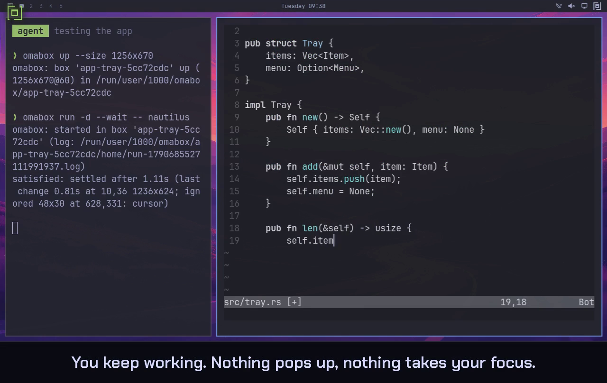
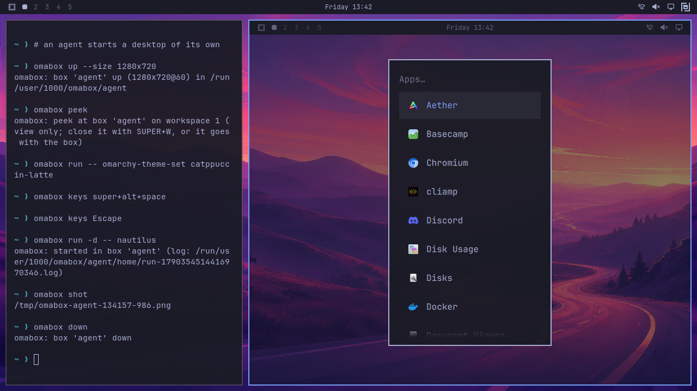
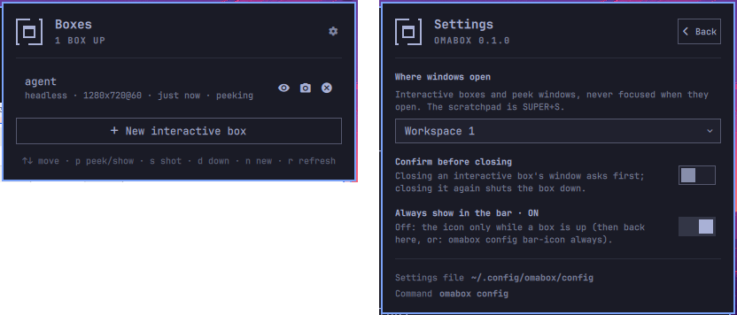

<h1>
  <picture>
    <source media="(prefers-color-scheme: dark)" srcset="assets/omabox-lockup-dark.svg">
    
  </picture>
</h1>

[](https://github.com/tcballard/omarchy-badges)\
[omabox.app](https://omabox.app) · an independent community project, not affiliated with or endorsed by
Omarchy

**Your agents get desktops of their own. Yours stays untouched.** omabox gives every AI agent a
whole Omarchy desktop, invisible and in parallel, to launch, click, type and screenshot apps and
shell plugins in. No windows popping up on your screen, no cursor jumps, no stolen focus or
workspace switches, no password or keyring prompts, no notifications or tray icons left behind.

A box is the real thing, not a mock: Omarchy's own Hyprland config, the Omarchy shell (bar, menu,
tray, notifications) and your theme, bar layout and terminal settings, on a private screen and a
private session bus. It starts in 3-4 s and uses about 500 MB. Each agent session gets its own box,
the way you give each agent a worktree. When you want to look, peek at a box live, or open one as a
window and use it yourself.

omabox keeps an agent's apps off your desktop; it is not a sandbox. To fence the agent itself in,
pair it with [ai-jail](#related-projects).

[](https://diogochaves.github.io/omabox/docs/media/clip-0.2.0.mp4)

[Watch omabox 0.2.0 in 43 seconds](https://diogochaves.github.io/omabox/docs/media/clip-0.2.0.mp4).
It was recorded inside omabox: a box played the desktop, with the agent's boxes inside it, so the
real desktop saw no window at all.

## What you need

- **Omarchy 4** on Arch, with Hyprland 0.56+ (the Lua config).
- **A GPU render node** (`/dev/dri/renderD*`). Tested on AMD and Intel iGPUs, an NVIDIA RTX 4070
  SUPER (driver 615.71.09) and an RTX 5070 Ti (610.57.04, open kernel module). A headless box takes
  the first usable node (`OMABOX_RENDER_NODE` overrides); an interactive box renders on the GPU your
  desktop renders on.
- For headless boxes on NVIDIA and for confirm-close: aquamarine's fix (Hyprland's backend library),
  until a release ships [PR #415](https://github.com/hyprwm/aquamarine/pull/415). Everything else
  runs on your system's aquamarine. `install.sh` builds it privately into `build/prefix`
  (`omabox setup --aquamarine`); your system's copy is not touched. That build also carries a fix
  of omabox's for interactive boxes: a key held when the box's window loses focus is released.

## Install

```bash
git clone https://github.com/diogochaves/omabox && cd omabox
./install.sh                            # packages (sudo only if some are missing), aquamarine's fix, tools, links
./install.sh --check                    # the same, then start a box, screenshot it, tear it down
```

`install.sh` then runs `omabox setup`, which links `~/.local/bin/omabox`, the agent skill (wherever
Omarchy puts its own skills: `~/.agents`, `~/.claude`, `~/.codex`, `~/.pi/agent`, `~/.hermes`) and
the bar widget, and asks whether to put the widget in your bar and to turn on the
[agent guard](#the-agent-guard) (or: `omarchy plugin enable chaves.omabox`, `omabox guard on`). **Update** with `git pull && ./install.sh`;
run it after a Hyprland upgrade too: a private aquamarine whose soname Hyprland no longer links is
skipped for the system's (`omabox --version` says which one boxes use). **From a checkout to the
package** (once Omarchy's repository has it): `omabox setup --remove` in the checkout first; if you
forget, the package's `omabox setup` finds the checkout's `~/.local/bin/omabox` and offers to remove
it. After an upgrade the bar runs the old widget until the shell restarts; its panel says so.

<details>
<summary><b>Remove</b></summary>

```bash
omabox down --all                          # every box
omabox setup --remove                      # guard and broker off, widget disabled, links removed
rm -rf ~/.config/omabox ~/.cache/omabox    # settings, and box HOMEs a crash left behind
rm -rf ~/.local/share/omabox               # saves, if you made any
```

`omabox setup --remove` turns the guard off (if on), the ai-jail broker off (its `~/.ai-jail` lines
are yours to delete), disables the bar widget if it is on, and removes the links `setup` made (only
those that still point at this omabox) and a per-user aquamarine build; it keeps your settings and
saves. Run it before you delete omabox: once it is gone there is no `guard off` left to
run. A guard left behind applies nothing in Claude Code and says so; in Codex its values stay, and
its hook says which lines of `~/.codex/config.toml` to delete.

Then delete the clone (its `build/` holds the aquamarine build). `omabox guard off` leaves a
`.bak-<time>` of `~/.claude/settings.json`, `~/.codex/config.toml` and `~/.codex/hooks.json` next to
each, from every change it made. The packages `install.sh` added stay; it printed them as `missing:` if there were any
(`labwc`, `passt` and the build tools are the likely ones): `sudo pacman -Rns` those you do not use.

</details>

## Using it

```bash
omabox up                              # headless box, 1920x1080; returns when the bar is drawn
omabox run -d -- ./build/src/myapp     # launch an app inside (detached; prints its log path)
omabox shot                            # screenshot; prints the PNG path (--fit 2000: scaled down)
omabox windows                         # the box's windows, where they are, what covers them
omabox shot --window myapp             # one window's own pixels, covered or on another workspace too
omabox keys super+space                # key combos reach Hyprland binds and the focused app
omabox keys -t 'hello world' Return    # type text, then press a key
omabox keys --wait super+space         # ...and return once the screen has settled (no sleeps)
omabox wait window myapp               # or: still, change, layer NAMESPACE, cmd -- CMD (--gone too)
omabox click 960 540 [right] [--double]
omabox click --window myapp 40 12      # window coordinates; --in SHOT X Y: that shot's pixels
omabox drag --window myapp 10 10 200 80   # press, move, release; --shot FILE while it is held
omabox hyprctl -j clients              # the box's Hyprland, never yours
omabox lua 'hl.get_active_window()'    # Lua in the box's Hyprland, and what it returns (JSON)
omabox run -- busctl --user list       # any command inside the box; exit code passes through
omabox log shell --grep qml -n 20      # the box's logs (Hyprland's by default; -f follows)
omabox events --since 30s --grep urgent   # Hyprland's events, stamped; --mark, --until RE, -f
omabox down                            # kill everything in the box
omabox ls                              # boxes, mode, size, state, plugins
```

- **Names**: a box is named after the current git repo. Inside a Claude Code or Codex session (or
  an agent started with `omabox guard exec`) the name also gets the session's id, `myrepo-5cc72cdc`,
  so two agents in one repo each get their own box, and it goes down when its agent exits (not while
  you peek at it or an `omabox run` is going). An agent does not pick up a box you started yourself
  unless told `-b myrepo`. `-b NAME` or `OMABOX=NAME` picks a box; `OMABOX_SESSION=` (empty) turns
  the per-session names off. Two repos with the same directory name need `-b`.
- **Screen**: `--size 3440x1440`, `3440x1440@144`, or `host` for your focused monitor;
  `omabox mode` changes it live.
- **Idle**: a headless box goes down after 2 hours with no `omabox` command, peek or `omabox run`
  against it (`--idle 30m`, `--idle 0` for never, or `OMABOX_IDLE`). A `run -d` job does not count.
- **More**: `--stock-bar` (Omarchy's default bar instead of a copy of yours), `--systemd` (a real
  systemd user manager, for plugins that manage a service or schedule alarms), `--from SAVE` (start
  with a HOME kept by `omabox save SAVE`: an app already signed in or set up), `--env KEY=VAL` (for
  the whole box session), `--xwayland`, and `omabox gpu 10` (GPU time of one box's processes, where
  the driver reports per-process counters). `omabox help` lists every flag, `omabox help CMD` (or
  `omabox CMD --help`) one command's.

### Tests that touch the desktop

```bash
omabox run -- ctest --test-dir build --output-on-failure
```

With no box up, `run` starts a throwaway box, mounts the current repo as a **discarded overlay**
(the tests can write `build/Testing/`, your checkout never changes), runs the command and tears the
box down. Notification tests register with the box's bar instead of piling up in yours; tray tests
need a tray in it (`--stock-bar` if your bar omits one). `up`'s options apply:
`omabox run --net isolated --allow 8081 -- ctest ...` keeps tests away from your real local services.
With `-b NAME` the box must be up. With a box already up, `run` uses it, and the repo is read-only
there: for tests that write into the tree, `omabox down` first. The command gets the box's
environment, not your shell's; `--pass NAME` hands it one of your variables, a password too, through
a pipe, never on a command line, and `--env-file dev.env` a whole file of them.

### Shell plugins

```bash
omabox up --plugin ~/code/myplugin          # or an id from ~/.config/omarchy/plugins
omabox restart-shell                          # after editing the plugin
```

The plugin is mounted read-only and turned on in the box's `shell.json` where its manifest says.
The box's bar has the built-in widgets plus the plugins you mount, nothing else. When that leaves it
with no workspace numbers, it gets Omarchy's: where your plugin's were, or after the menu.
When the shell does not load a plugin (a manifest it refuses, a QML error), `up` and `restart-shell`
say why, with Omarchy's plugin validator's message when it has one; the box comes up anyway.

### A Hyprland change

```bash
omabox up patched --hyprland ~/code/Hyprland/build/Hyprland   # your build, never installed
omabox up stock                                               # the installed one, to compare
```

The box runs your build instead of `/usr/bin/Hyprland` (its folder mounted read-only), with the
rest of the box as usual: the Omarchy shell, your bar, `hyprctl` and `hyprpm` from your system (a
warning when their version is not the build's). The build must link a `libaquamarine` soname the
box has (your system's, or omabox's private build); `up` refuses one that does not, or a file that is not an executable
ELF, before the box starts. `omabox ls` and `omabox windows` name the build, so a box on it is never
taken for a stock one. A box runs the compositor's logic for real (layouts, focus, input routing, the
Lua config, IPC, protocols) on a virtual output with virtual input devices; the DRM/KMS backend
(modesetting, real monitors, HDR/VRR, multi-GPU), libinput with real devices and the
session/suspend/lock paths never run in one.

### An Omarchy change

```bash
omabox up dev --omarchy ~/src/omarchy      # your Omarchy checkout instead of /usr/share/omarchy
```

The box runs that tree as `omarchy dev link` would, without touching your system: its Hyprland
config, its shell (bar), its `bin/` first on the box's PATH (binds, menus, `omabox run`), and
`OMARCHY_PATH` in a terminal's bash. The tree is mounted read-only at its own path, so an edit shows
after `omabox restart-shell` (the shell) or `omabox hyprctl reload` (the config). It must have
`bin/`, `default/hypr/bootstrap.lua` and `shell/shell.qml`. Files Omarchy installs outside its tree
(`/etc`, systemd units, `/etc/skel`) stay the installed ones. A box never follows your own
`omarchy dev link`: without `--omarchy` it runs the packaged Omarchy.

## Seeing a box yourself

<p></p>

- **`omabox peek -b NAME`**: a live, view-only window of any box on workspace 9, opened without
  focus. It only copies frames out, so the agent never notices, and closes with SUPER+W or when the
  box goes down. For a few seconds it shows what the agent does: a ring where it points and clicks,
  and the keys it types (a `--pass` password as `*`), never in the box's own screen or screenshots.
- **`omabox up --interactive`**: the box is a real window on workspace 9 that you drive with your
  own keyboard and mouse. **SUPER+ALT+ESCAPE** sends SUPER keys to the box instead of your desktop,
  once; **`omabox keys-to-box -b NAME on`** (or the keyboard button in the widget) sends them
  whenever the box's window has focus and the pointer is over it. While they go to a box, its border turns the theme's red and
  the widget's icon lights up. The box follows the window's size; closing the window ends it.
- **`omabox clip`**: your clipboard's item (text, or an image by its type) into an interactive box,
  once; `clip --from-box` hands the box's back. With no `-b` it is the box whose window has focus
  (else the only interactive one), so a key binding pastes into the box you are in. None is
  installed; for SUPER+ALT+V, add to `~/.config/hypr/bindings.lua`:
  `o.bind("SUPER + ALT + V", "Clipboard into the box", "omabox clip")` (not while
  SUPER keys go to the box: after SUPER+ALT+ESCAPE, or with keys-to-box on and the box focused). Nothing keeps watching either clipboard. It is
  never for agents: refused in their sessions, under the agent guard and in ai-jail (headless boxes
  are refused too). A password manager's "sensitive" mark goes along, so clipboard histories leave
  the secret out; what you hand to a box can still be read there by whatever runs in it, an agent
  driving that box included.
- **The bar widget** (`chaves.omabox`): the omabox mark in your bar lists every box, with **Peek**
  (or **Show**, for an interactive one), **Screenshot** and **Down**, **Paste your clipboard into the
  box** and **Copy the box's clipboard out** on an interactive one, and **New interactive box**.
  For omarchy-console's rail it also exposes `consoleAwake` (true while a box is up) and
  `consoleState` (`running` then), the console's convention for a module's state.

<p></p>

<details>
<summary><b>Settings, and the widget's keys</b></summary>

Settings live in `~/.config/omabox/config`: `omabox config` lists them, the widget's gear changes
them, and `omabox config KEY default` puts one back.

- `workspace WS`: where interactive and peek windows open, always without focus: `1`-`99`,
  `special` (Omarchy's scratchpad: SUPER+S shows and hides it) or `special:NAME` (bind a key to it
  yourself). Per box: `up --interactive --workspace WS`, `peek --workspace WS`. The default is 9.
- `confirm-close on`: closing an interactive box's window asks first. The box opens a new window
  where you are, with Omarchy's menu ("Shut down" / "Keep it running"); closing that window too is a
  yes. It applies to running boxes as well. Per box: `--confirm-close` or `--no-confirm-close` on
  `up`. It needs aquamarine's fix (`omabox setup --aquamarine`): without it, boxes leave it off and
  the bar widget greys its switch out.
- `bar-icon`: `always` (the default) keeps the widget's icon in the bar with no box up, dimmed, so
  its settings are a click away; `auto` shows it only while boxes exist.

Passthrough (SUPER+ALT+ESCAPE) turns itself off when focus leaves the box, or on the first key you
press with the pointer outside it. With **keys-to-box** on (per box, off by default, until the box
goes down) focus and the pointer decide, with no key to press: while the box's window has focus and
the pointer is over it, SUPER is the box's; move the pointer off it (onto your bar, an empty part of
the workspace, another monitor) or focus elsewhere, and SUPER is yours again, keys-to-box still on;
the pointer back over the box, SUPER is the box's again. The first key you press with the pointer
off the box is already yours (SUPER+1 switches your workspace at once). `omabox keys-to-box -b NAME`
says whether it is on, `on`/`off` changes it, and `omabox ls` shows it. SUPER+ALT+ESCAPE over the
box gives the keys back until the box loses focus and gets it again. Either way, while keys go to a
box its window's border takes the theme's red (the colour the bar uses for what calls for
attention) and the widget's icon is lit in it.

The widget's panel shows each box's mode, size, age, plugins, whether it is being peeked at and
where its keys go, and a count in the bar when there are several. Keys: arrows or j/k, Enter or `p`
peek/show, `s` shot, `v` paste your clipboard in and `c` copy the box's out, `f` keys-to-box on or off
(these three on an interactive box), `d` down (twice within 3 s;
Enter on a dead box arms it), `n` new, `r` refresh. **New interactive box** starts one under a free name (`omabox up --interactive --new`:
box-1, box-2, ...) and brings its window forward. If `omabox ls` fails, the panel says so. The
widget only displays `omabox ls --json` and runs `omabox`; the CLI owns every rule.

</details>

## Agents

`install.sh` installs the `omabox` skill wherever Omarchy installs its own agent skills, so Claude
Code, Codex, OpenCode, pi and Hermes load it when a task involves a GUI app, a screenshot, a shell
plugin or desktop-touching tests. Projects need no changes: when a project's own instructions say
"run the app", "screenshot with grim", "use hyprctl" or "run ctest", the skill has the agent do
exactly that in a box.

To make it a rule rather than the agent's judgement, add a line to your agent's global instructions
(`~/.claude/CLAUDE.md`, `~/.codex/AGENTS.md`, `~/.config/opencode/AGENTS.md`, ...):

> Never launch, screenshot or drive GUI apps on my desktop, and never run tests that touch the desktop
> session there. Use omabox (see the omabox skill).

### The agent guard

The skill is advice: an agent that does not think of `./build/tests/tst_x` as GUI work still opens
its windows on your desktop, because its shell holds your real display. The guard (opt-in; Claude
Code and Codex, or any agent through `guard exec`) makes that fail instead: agents' shells get a
display that does not exist, so a stray window, `hyprctl`, `grim` or `omarchy-theme-set` fails with
an error the skill explains, and a link an agent opens is refused instead of landing in your
browser. `install.sh` asks (yes by default); it never turns the guard on by itself.

```bash
omabox guard on               # every installed agent (or: on claude | on codex); a backup next to each file
omabox guard off              # take it out again (each file as it was)
omabox guard                  # is it on, per agent; what it does
omabox host -- CMD            # from a guarded shell: one command on your real desktop, when you asked for it
omabox guard exec -- AGENT    # any other agent: start it under the guard
```

<details>
<summary><b>What the guard sets, per agent, and what it does not stop</b></summary>

Agents' shell commands get `WAYLAND_DISPLAY=omabox-guard`, `HYPRLAND_INSTANCE_SIGNATURE=omabox-guard`,
an empty `DISPLAY`, an empty `QT_QPA_PLATFORMTHEME` (Omarchy's `gtk3` would make even an offscreen Qt
test start GTK, which needs a display, so `ctest` with `QT_QPA_PLATFORM=offscreen` keeps working) and
`QT_FORCE_STDERR_LOGGING=1` (a Qt program with no display aborts; this way the agent reads why).
A browser already running on your desktop takes a URL over its own socket, not the display, and with
`misc:focus_on_activate` takes focus too. So `BROWSER` and `GH_BROWSER` name omabox's
`share/guard/xdg-open`, which fails with a note to give you the link instead, and Claude Code and
`guard exec` also put it first on PATH as `xdg-open`. Inside a box, links open as usual. Quickshell's
own IPC needs no display either, so `quickshell kill` or `qs ipc` from a guarded shell would reach
your desktop's shell (`omarchy restart shell` stopped it, and could not start it again): the same
PATH puts `share/guard/quickshell` and `qs` first, which refuse `kill` and `ipc` and pass the rest on.

- **Claude Code**: one `SessionStart` hook in `~/.claude/settings.json` (merged with yours). Every
  shell command of the session gets the variables, subagents' too, plus a core limit of 1 byte, so a
  Qt program's abort never becomes a "Process crashed" notification on your desktop. It also tells
  the agent in one line what the error means and when `omabox host` is allowed. Claude Code's own
  process is not changed (clipboard paste, opening the browser). Your own `!` commands in Claude Code
  run in the session's shell, so they get the guard too: run desktop commands (`omarchy restart
  shell`, `hyprctl reload`, a theme switch) in your own terminal, or ask the agent to use `omabox
  host`. If omabox is gone (deleted without `guard off`), the hook applies nothing
  and says so in one line.
- **Codex**: `[shell_environment_policy.set]` in a marked block of `~/.codex/config.toml` (a config
  whose own `set` table would clash is refused, untouched, with the lines to add by hand), and a
  `SessionStart` hook in `~/.codex/hooks.json` that gives the agent the same note. Codex runs that
  hook only after you trust it once (`/hooks` in Codex). No core limit. The block's values are fixed,
  so they stay if omabox is gone: the hook then tells the agent how to take them out. The variables
  were checked through `codex sandbox`, the hook only by what Codex's hooks.json takes, not in a
  logged-in session.
- **Anything else**: `omabox guard exec -- AGENT` starts the agent itself under the guard. Its own
  process loses the display too (clipboard, opening a browser to log in; `xdg-open` refuses). It also
  gets a session of its own (`OMABOX_SESSION`), so its default box is its own, as in Claude Code and
  Codex.

omabox keeps working under the guard: boxes have their own display, and `up --interactive`, `peek`
and `--size host` find your session by themselves. Work you ask for on your real desktop ("switch my
theme", `hyprctl reload` after editing your config) goes through `omabox host -- CMD`: your session's
display, `DISPLAY` and Qt theme for that one command, which it names on stderr, so it stays on the
record.

It stops accidents. It does not stop:

- an agent that sets the variables back, or runs `omabox host` unasked, on purpose;
- processes the agent starts itself rather than through its shell (MCP servers: a headed browser
  MCP opens on your desktop);
- file writes: your shell watches `~/.config/omarchy/shell.json` and `~/.config/omarchy/plugins/`,
  so an agent editing them (or running `omarchy plugin add` on the host) changes your real bar at
  once; the skill sends those writes to the box's HOME;
- anything over the session bus or the user manager (notifications, the keyring, apps started over
  D-Bus, `uwsm-app` and `systemd-run --user`, which run in your session's environment);
- links opened by other routes: a browser started directly with a URL (it hands the URL to the one
  already running), `gio open` (it starts your URL handler itself), npm's `open` (it runs its own
  copy of xdg-open), or, under Codex, a plain `xdg-open` (Codex gets `BROWSER` and `GH_BROWSER` but
  not the PATH entry). Python's `webbrowser` stops at omabox's `xdg-open` (it counts one that has
  started as a success), except under `guard exec` from an omabox at a path with a space: there it
  tries the next browser when that one fails.

For a fence, run the agent in a sandbox that blocks Unix sockets (Claude Code's `sandbox`: it also
blocks the network and every other socket, omabox's included), or see
[ai-jail](#related-projects).

</details>

## What a box can and cannot touch

- **Your files**: the repo you run `omabox up` from, **read-only** at the same path, plus the dirs
  in `~/.config/omabox/ro-bind` (one per line) or `--ro-bind`; mise's toolchains (so `omabox run`
  finds node, python, uv as on the host), the `--plugin` dirs, and your git `user.name` and
  `user.email`. Nothing else of your HOME. Refused whatever you pass: anything that is or contains
  HOME, `~/.config/omarchy` or `/tmp`, the secret stores (`~/.ssh`, `~/.gnupg`, keyrings,
  `~/.password-store`, `~/.aws`, `~/.kube`, `~/.docker`, `~/.netrc`, `~/.git-credentials`, gh's,
  gcloud's, azure's and 1Password's `op` config), omabox's own saves and box HOMEs
  (`~/.local/share/omabox`, `~/.cache/omabox`), your runtime dir, `/run`, `/dev`, `/proc`, `/sys`.
- **Its HOME** is fake, seeded with your theme and shell settings and nothing secret (no API keys,
  keyrings or tokens), and `omabox down` deletes it with whatever a plugin or app changed there.
- **Its session**: a private session bus and a throwaway keyring (secrets stored and read without
  prompts), no system bus, no real input devices, no audio, no Xwayland unless `--xwayland`.
  `/usr`, `/etc` and `/sys` are read-only, with no `sudo`, pacman or polkit, so nothing in a box can
  install packages, system config or rules. Your host's processes are not visible from it.
- **Your seat**: a box never gets `/dev/dri/card*`, `/dev/input`, seatd, the system bus or your real
  `$XDG_RUNTIME_DIR`: that is what keeps its Hyprland off your real screens. An interactive box
  holds one already-open connection to your compositor, never its socket, so nothing inside can open
  windows on your desktop. Keys go the other way: what you type into its window, the box reads.
- **The network**: every box has one of its own. By default (`--net connected`) it reaches the
  internet, your LAN and your host's servers, and you reach its servers; with `--net isolated` it has
  only a loopback and the host ports you `--allow` (`omabox up --net isolated --allow 8081,8082`).
  What reaches outside (API calls, uploads, changes to a server) is real, and `down` does not undo it.
- **Not a security boundary**: a box shares your kernel and GPU (a runaway app can load or hang it)
  and, by default, your network. Commands you run on the host, a project's `sudo ./setup` or
  `omabox host -- CMD`, are not boxed. For code you do not trust, use `--net isolated` at least,
  [ai-jail](#related-projects), or a VM. [SECURITY.md](SECURITY.md) lists each rule that keeps a box
  off your desktop, where it is enforced and the test that proves it.

<details>
<summary><b>Networking and mount details</b></summary>

- Across the box boundary, use `127.0.0.1:PORT`, with a server that listens on IPv4 (`127.0.0.1`,
  `0.0.0.0` or `::`). `localhost` works from your host into a box, but from a box it is reset when
  the server listens on IPv4 only, as most dev servers do, and from one box to another it never
  works. A server in a box that listens on `::1` only cannot be reached from outside it, though its
  port is still taken on your `127.0.0.1`, where connections to it are reset.
- A box's ports are forwarded to your host's `127.0.0.1` only (never your LAN address), usually
  within a second of its server listening, the ephemeral range included; other boxes reach them
  there too. A TCP port there also takes the UDP port of the same number. So while a connected box
  runs a server on a port, your own server cannot start on it; an isolated box's ports stay its own
  (two isolated boxes can use the same port). The other way round, a connected box sees your
  host's servers on their ports, another box's forwarded ports among them, so a server a box starts
  on a port your host or another connected box already has fails to start (address in use). Only
  servers started in two boxes within about a second of each other both run, each answering inside
  its own box, and only one of them gets the port on your `127.0.0.1`. A dev server that takes the
  next free port when its own is taken (as Vite does) moves on by itself.
  `omabox ports` lists every box's servers and what holds each port on your
  `127.0.0.1`: that box, any of the boxes sharing it, or one of your own processes.
- To open a box's server from another machine on your tailnet, share its port from your host with
  Tailscale: `tailscale serve --bg --http=3000 3000`, then open `http://<machine-name>:3000` (by
  name: the tailnet IP answers 404). Everyone on your tailnet reaches it, users you share the
  machine with included; your LAN does not. It stays on after the box goes down (answering 502)
  until `tailscale serve --http=3000 off`.
- Inside a box, your machine's LAN address is the box itself. A connected box started inside
  another box has no network.
- Every box needs `passt` (which `install.sh` installs), and a connected one `/dev/net/tun`. Its own
  network also keeps what runs in it from reaching or taking your host's abstract sockets (a box's
  X11 display used to catch X11 apps started on the host).
- `--ro-bind DIR:DEST` mounts a dir somewhere else (`--ro-bind ~/nas:/mnt/nas`, to test path
  mapping); DEST cannot be `/`, a system dir, `/run`, `/tmp` itself, `/opt/omabox`, the box HOME, or
  a dir above those. A plugin dir inside `~/.config/omarchy/plugins` is fine. A throwaway `run`
  outside a repo mounts nothing of the current dir.

</details>

Some things still need your real machine: your real data and services, desktop integration outside a
session (.desktop files, URL handlers, autostart; systemd user units only in a `--systemd` box, and
never with journald or logind), real monitors (scaling, multi-monitor), lock/idle/suspend, and final
release acceptance.

## Related projects

omabox does one thing: keep agents off your desktop while they test on a desktop of their own.
These projects are good at what it does not do.

- **[ai-jail](https://github.com/akitaonrails/ai-jail)** ([aijail.io](https://aijail.io)), by Fabio
  Akita, fences the agent in: bubblewrap, Landlock and seccomp on Linux, `sandbox-exec` on macOS, so
  your home, keys and cloud credentials are out of reach. ai-jail answers what the agent can touch,
  omabox where it draws, and they stack. To run a build you do not trust yet with the box's screen as
  its only display (tested with ai-jail 2.6.2 and omabox 0.4.4):

  ```bash
  omabox up
  eval "$(omabox env)"   # Wayland clients now draw in the box
  ai-jail --gpu --rw-map "$WAYLAND_DISPLAY" --env WAYLAND_DISPLAY -- ./build/app
  ```

  An agent inside ai-jail can drive boxes of its own through omabox's broker
  ([#16](https://github.com/diogochaves/omabox/issues/16)), with no change to ai-jail. The jail
  cannot enter a box itself (its seccomp filter refuses new namespaces), so its `omabox` hands each
  command to the broker outside:

  ```bash
  omabox broker on   # a systemd user socket; prints the lines to add to ~/.ai-jail
  ```

  Add those lines (they map omabox, its relay, the skill and the broker's socket into the jail,
  read-only), then run `ai-jail claude` as usual: `omabox up`, `shot`, `keys`, `click` and the rest
  work inside the jail as outside. The broker keeps a jail's boxes to what the jail has: no network
  when the jail has none (`--net isolated`), only the jail's own project mounted, and only the boxes
  that jail started (never yours, nor another jail's), which go down when the jail exits. Driving a
  box is running code in it, so that is what stops a box from being a way out of the jail. Not for a
  jailed agent: `omabox host`, `peek`, interactive boxes, `guard`, `config` changes. A shot is
  written into the jail by its own `omabox`; the broker never opens a path the jail names.
  `omabox broker off` turns it off. Checked with ai-jail 2.2.1 and 2.6.2.
- **[omarchy-in-omarchy](https://github.com/jankeesvw/omarchy-in-omarchy)** is a disposable Omarchy
  in QEMU/KVM (8 GB of RAM by default, minutes on its first start): for what needs a whole machine,
  an installer or an `omarchy-update` migration, system services, audio, suspend, a reboot, where a
  box has no system bus. Boxes while developing, a VM before a release.
- **[Cua](https://github.com/trycua/cua)** ([cua.ai](https://cua.ai)) is for the opposite: agents
  that use your own desktop and apps, across macOS, Windows, Linux and Android.

Checked on 2026-10-01 against each project's own pages; they move on their own, so check theirs.
The longer comparison is on [omabox.app](https://omabox.app/compare).

## How it works

```
[pasta]                        boxes behind pasta: connected (default), or isolated (--allow ports)
└ bwrap (pid/ipc/uts namespaces, fake HOME, private /run/user/$UID and /tmp)
  └ share/session.sh           the session: private bus (dbus-daemon), keyring, PATH, env
    ├ [systemd --user]         --systemd only (in its own delegated cgroup scope)
    └ labwc, headless          invisible parent compositor
      └ Hyprland, nested       Omarchy's default config; screen = a headless output of any size
        ├ quickshell           the Omarchy shell (not with --no-shell)
        └ your app             via `omabox run` (nsenter into the box)
```

In interactive mode, labwc is left out: Hyprland runs inside your Hyprland through a single
Wayland connection.

| Path | What |
|---|---|
| `bin/omabox` | the CLI (bash) |
| `share/` | runs inside the box: session, Hyprland config, shell launcher |
| `tools/pointer`, `tools/keyboard` | virtual pointer and keyboard; `wtype` sends the wrong keys under Hyprland |
| `tools/wlfd` | hands an interactive box its one connection to your compositor |
| `tools/peek` | the live view-only window (`omabox peek`) |
| `tools/still` | waits in a box until its screen holds still or changes (`omabox wait`, `--wait`) |
| `tools/events` | records a box's Hyprland events, stamped, from its start (`omabox events`) |
| `tools/relay` | carries an omabox command from inside ai-jail to the broker outside (`omabox broker`) |
| `skill/` | the agent skill (Claude Code, Codex, OpenCode, pi, Hermes) that sends agents here |
| `plugin/` | the bar widget |
| `test/run.sh` | the regression suite: real boxes, never the real desktop (`test/run.sh unit` is fast) |
| `NOTES.md` | design notes: architecture, findings (cited in the code as "finding N"), dead ends |
| `spike/` | the original proof of concept |

Boxes live in `$XDG_RUNTIME_DIR/omabox/<name>/` (`omabox path`): `box.json` (its options),
`info.json` (bwrap's pids; `pid` and `pasta.pid` for a box behind pasta), `run/` (the box's runtime
dir), `used` (idle clock), `events.marks` (`omabox events --mark`), `reap.log`, `box.log`. The box's HOME (`home/`, on disk in
`~/.cache/omabox/<name>/home`, removed on `down`) and logs are readable from the host.

## Known limitations

- Other NVIDIA models and drivers are untested. Of the agents the skill is installed for, Claude
  Code and OpenCode were checked end to end; Codex, pi and Hermes find the skill, but no run of
  theirs reached a model here.
- Headless boxes on NVIDIA and confirm-close need aquamarine's fix (PR #415, built into
  `build/prefix` by `install.sh`, `omabox setup --aquamarine`) until a release ships it; without it
  `up` refuses them, saying what to run. What omabox carries until upstream releases land, and what
  to drop then: `UPSTREAM.md`.
- A hidden interactive box draws at the host's `misc.render_unfocused_fps` (15 by default), so
  `omabox shot` works with its window off screen, just at that rate. Not after you closed its window
  and kept the box running (`confirm-close`): the new window is only drawn while it is on screen.
- The file chooser portal was checked (xdg-desktop-portal-gtk); other portals are untested.
- Apps that need system services over the system bus (GNOME Disks/udisks, NetworkManager, bluetooth,
  power) open with errors or not at all: a box has no system bus, by design.
- Omarchy's app launching goes through a stand-in for `uwsm-app` in every box, `--systemd` or not
  (apps start as plain processes, not units); their output lands in the box's `home/apps.log`.
  Logging out of the box ends it. Without `--systemd`, `systemd-run --user` (the browser bind) runs
  its command directly too, timers excepted, and `systemd-cat` writes to `~/IDENTIFIER.log`, so
  `omarchy restart shell` works in a box.
- A `run -d` job does not count as use for idle expiry: a server the agent only polls over HTTP needs
  `--idle 0` (or a longer one). Nor does it keep an agent session's box once the agent exits.
- `omabox gpu` shows no per-process figures on NVIDIA 615.71.09, which does not report them. Tools
  that sum GPU time by process name add a box's Hyprland to yours: use `--size host` and `omabox gpu`
  to see what an animation costs.

## Contributing

Contributions are welcome, and so are people trying it on other NVIDIA models, other GPUs,
multi-monitor desks, or a fresh Omarchy install. Bug reports, fixes, tests and ideas all help;
[CONTRIBUTING.md](CONTRIBUTING.md) says how, and what a report needs. What changed in each version:
[CHANGELOG.md](CHANGELOG.md).

## License

MIT: see [LICENSE](LICENSE).
